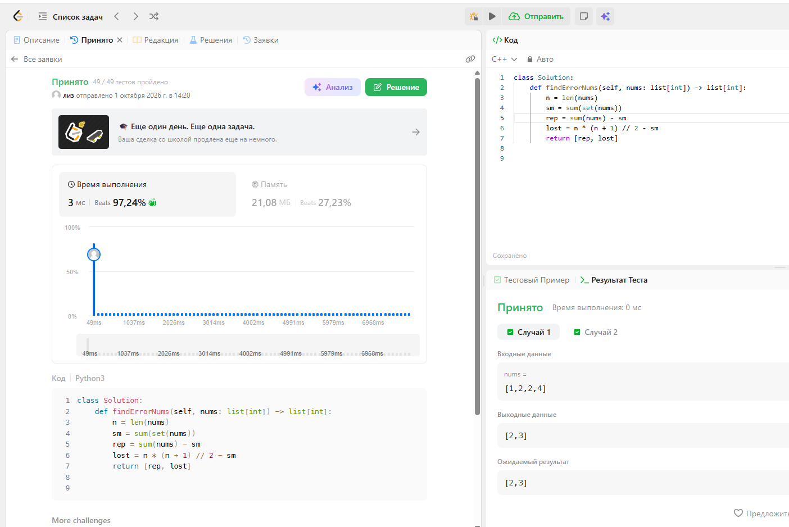
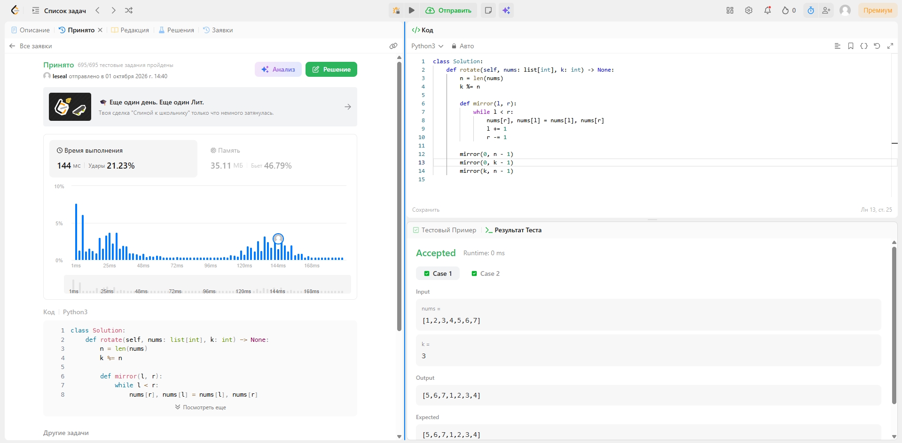
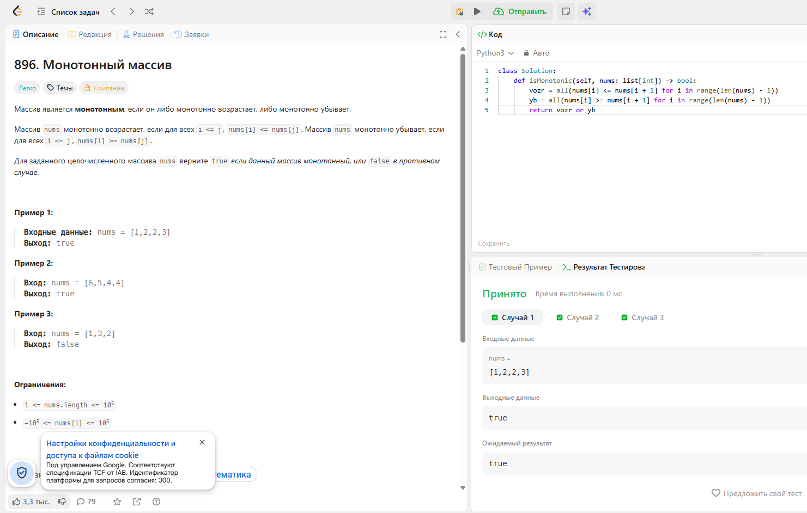
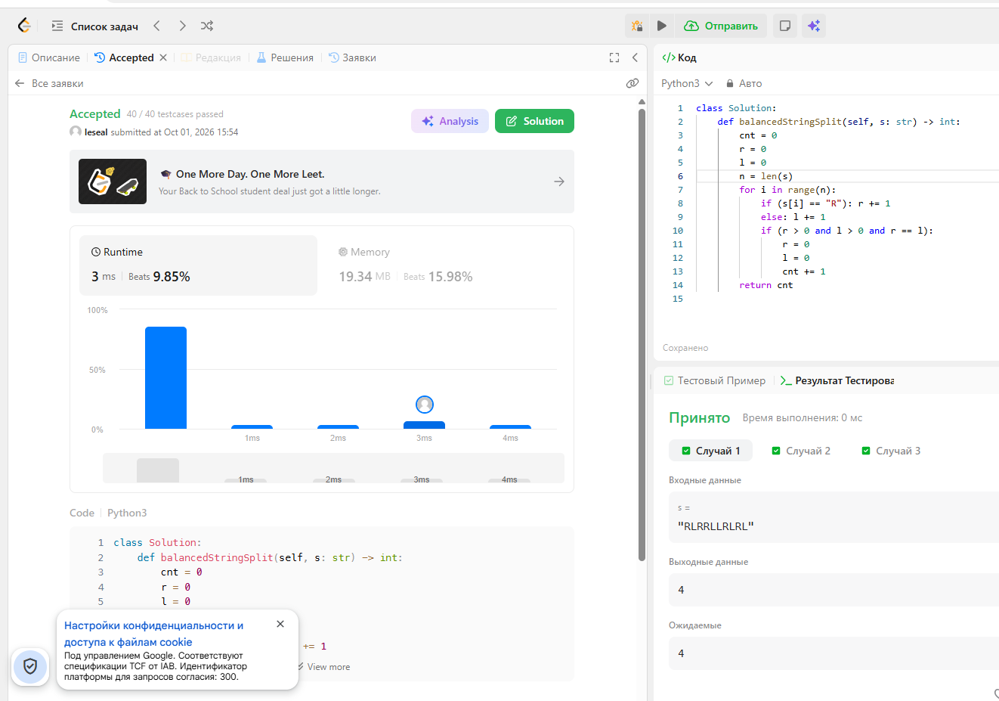
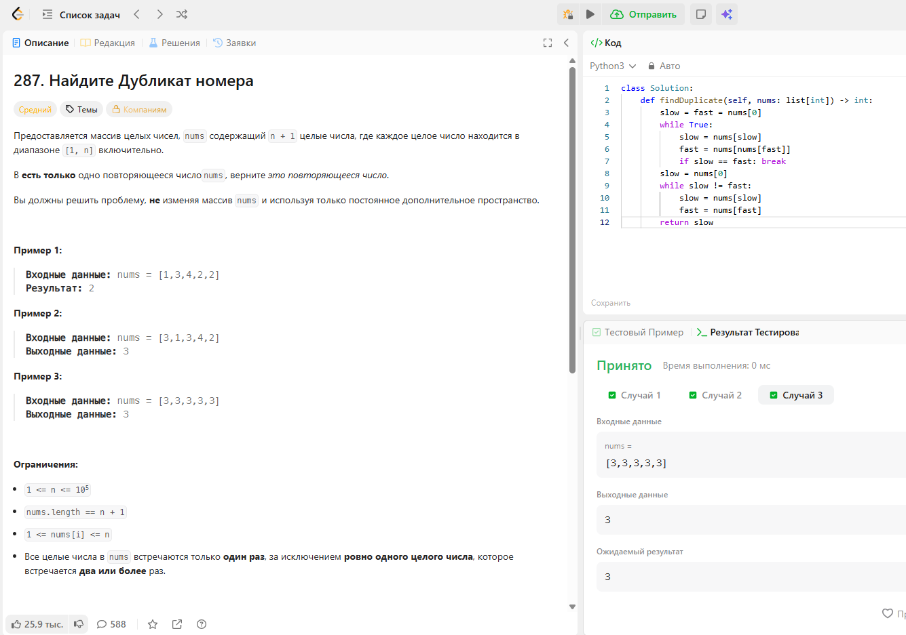

# **Вариант 48 (неполный)**

## 645. Несовпадение наборов



```python
class Solution:
    def findErrorNums(self, nums: list[int]) -> list[int]:
        n = len(nums)
        sm = sum(set(nums))
        return [sum(nums) - sm, n * (n + 1) // 2 - sm]
```


## 189. Rotate Array



```python
class Solution:
    def rotate(self, nums: list[int], k: int) -> None:
        n = len(nums)
        k %= n

        def mirror(l, r):
            while l < r:
                nums[r], nums[l] = nums[l], nums[r]
                l += 1
                r -= 1
        
        mirror(0, n - 1)
        mirror(0, k - 1)
        mirror(k, n - 1)
```


# **Вариант 77**

## 896. Monotonic Array



```python
class Solution:
    def isMonotonic(self, nums: list[int]) -> bool:
        vozr = all(nums[i] <= nums[i + 1] for i in range(len(nums) - 1))
        yb = all(nums[i] >= nums[i + 1] for i in range(len(nums) - 1))
        return vozr or yb
```


## 1221. Split a String in Balanced Strings



```python
class Solution:
    def balancedStringSplit(self, s: str) -> int:
        cnt = 0
        r = 0
        l = 0
        n = len(s)
        for i in range(n):
            if (s[i] == "R"): r += 1
            else: l += 1
            if (r > 0 and l > 0 and r == l):
                r = 0
                l = 0
                cnt += 1
        return cnt
```


## 287. Find the Duplicate Number



```python
class Solution:
    def findDuplicate(self, nums: list[int]) -> int:
        slow = fast = nums[0]
        while True:
            slow = nums[slow]
            fast = nums[nums[fast]]
            if slow == fast: break
        slow = nums[0]
        while slow != fast:
            slow = nums[slow]
            fast = nums[fast]
        return slow
```
